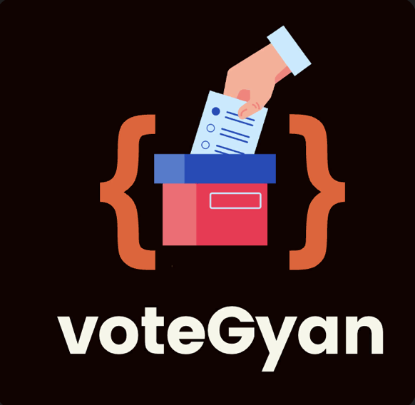

  <h2>voteGyan</h2>
  

<i>Empowering the next generation of voters through engaging education and gamification.</i>

  

---

  
  
  
  

---

## **Inspiration**

**Do you ever wonder whether your vote really matters?**
At 20, we found out how a lot of young adults were disconnected with the process of voting because it's just too complicated or has absolutely nothing to do with them. What if we told you that your vote is powerful to shape the future? And what if learning about it was actually easy, fun, and rewarding? That's why we've built voteGyan, so that voting education turns into a fun experience in which you earn points, level up, and unlock knowledge that empowers you to vote with confidence.

**Ready to Make a Real Difference?**
Time to stop wondering and start doing. voteGyan transforms this daunting process of learning about voting into a powerhouse of excitement and motivation. Are you ready to take control of your future and be part of that generation that makes its voice heard? The journey to an informed voter starts now.

---

## **What it does**
**voteGyan** is a mobile learning application that engages users in knowledge about the voting process and government, allowing users to earn points towards prizes.

### **Core Features**  
- **Interactive Lessons**  
  - Bite-sized, easily digestible modules explaining the voting process, government roles, and the importance of civic participation.
      
- **Personal Avatar System**  
  - Users can create and customize avatars, unlocking upgrades and accessories with earned points.  

- **Daily Challenges**  
  - Quick quizzes and mini-games that reinforce learning while encouraging streaks.  

- **Points and Rewards System**  
  - Earn points for completing lessons and challenges.
  - Redeem points for virtual prizes, such as avatar outfits or exclusive badges. 

- **Progress Tracking**  
  - Follow the learning progress, including streaks and point milestones, through a user-friendly dashboard.  

---

## **How we built it**

### **Technologies Used**

#### **Frontend**
- **React Native**: For building a responsive, cross-platform mobile app.  
- **Expo**: Simplifies app deployment and testing.  

#### **Backend**
- **Express.js**: API management and business logic.  
- **Firebase**:  
  - **Authentication**: Secure user login and session management.  
  - **Firestore Database**: Real-time storage for lessons, challenges, and user progress.  
  - **Cloud Functions**: Serverless execution for dynamic tasks.  

#### **AI Integration**
- **OpenAI GPT-4**:  
  - Generates engaging and informative quiz questions.  
  - Enhances lesson content with curated, unbiased information.  

#### **Design Tools**
- **Figma**: For prototyping and user interface design.  

### **Development Practices**
- Component-based architecture ensures maintainable, reusable code.  
- Progressive Web App (PWA) capabilities for offline access.  
- Secure storage for user data, compliant with best practices.  

---
## **Challenges we ran into**

1. **Data Accuracy**
- Making sure everything is unbiased, fact-checked, and credible.
  
2. **User Engagement**
- Implementing features that will make users want to come back every day and be more engaged.
  
3. **Scalability**
- Creating infrastructure that will handle a growing user base without performance issues.
---

## Accomplishments that we are Proud Of

- Designed a game-based rewards system that incentives users to learn.
- Designed an intuitive, mobile-first interface that works seamlessly across devices.
- Curated a database of impartial lessons to make civics accessible and impactful.

---

## **What we learned**

- **Gamification Works**: Small rewards can have a big impact on user engagement.  
- **Simplicity is Key**: Complex information can be made accessible through thoughtful design.  
- **Collaboration is Powerful**: Leveraging AI, Firebase, and frontend technologies together created a seamless learning experience.  

---

## What's next for voteGyan

1. **User Testing**
- Conduct usability studies with young voters to iterate on the app.

2. **Content Expansion**
- Adding modules on state-specific voting laws and civic participation.

3. **Enhanced Rewards**
- Add new avatar customization options, badges, and exclusive prizes to the app.

4. **Community Features**
- Create online forums for users to debate civil issues and share their insight.

5. **Dynamic Notifications**
- Alerts for personalized reminders - election dates or when the voter registration deadline approaches.

---

  <i>VoteGyan: Transforming civic knowledge into an engaging journey.</i>

